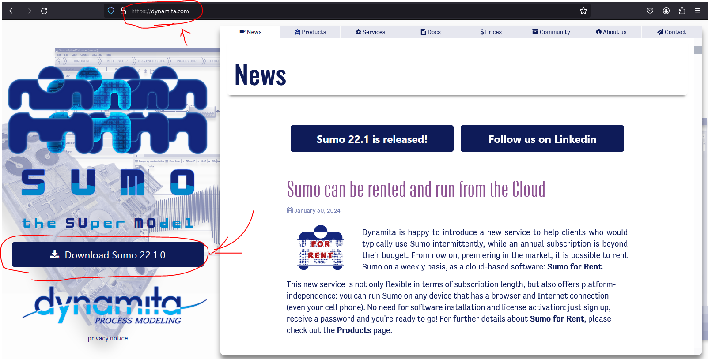
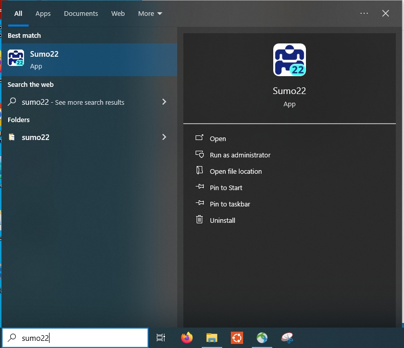
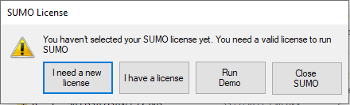
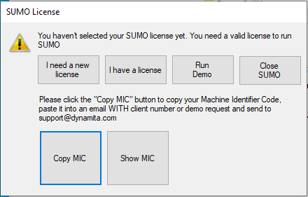

# Install and activate Sumo22

## 1. Download

Goto https://dynamita.com/previous-version.html and click to download the newest version of Sumo (Sumo22).

## 2. Install

Open the downloaded installer and follow the installation wizard.

## 3. Acquire and submit the machine identification code (MIC)

Launch Sumo22 from the start menu:

Sumo will ask for a valid license upon the first run, click `I need a new license`:

Then click `Copy MIC`:

An encoded MIC string will be copied into clipboard, paste it on canvas and submit. We'll contact Dynamita for a teaching license for each submitted MIC. The acquired license will have a expiration period to cover this semester.

MIC used to represent the identity of a computer instance. Though it is generally safe to share (as being encrypted and probably hashed), it *may* be subject to change after OS reinstallation or essential hardware upgrade. If you lose the access to Sumo during this semester with an MIC change, send your new MIC to Prof. Gu, and we'll try to request a new license.